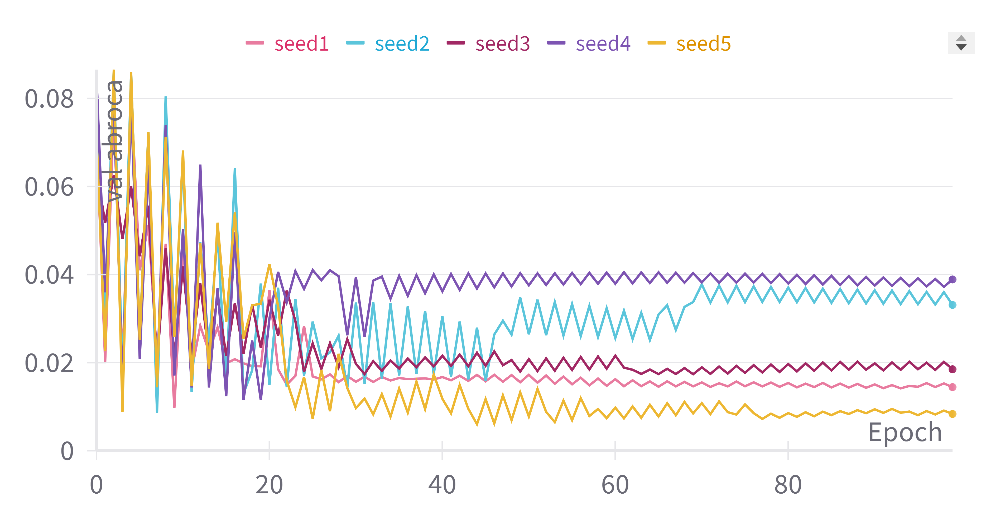
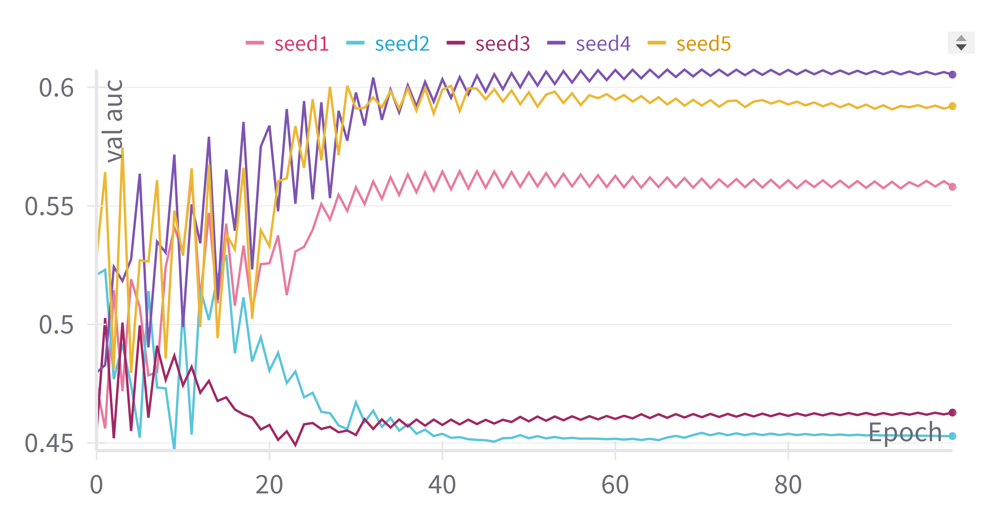
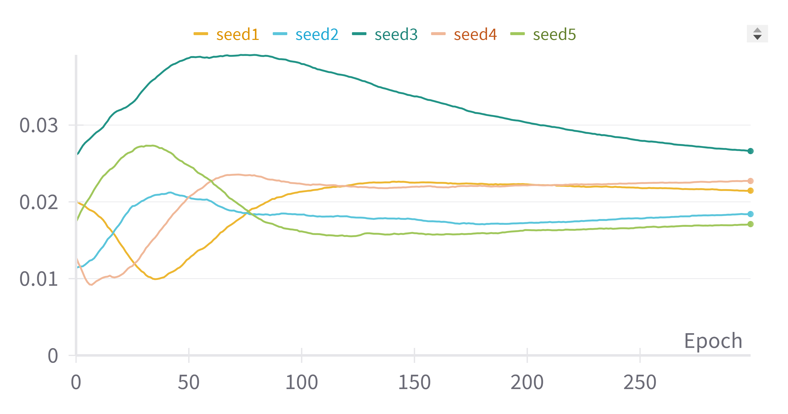
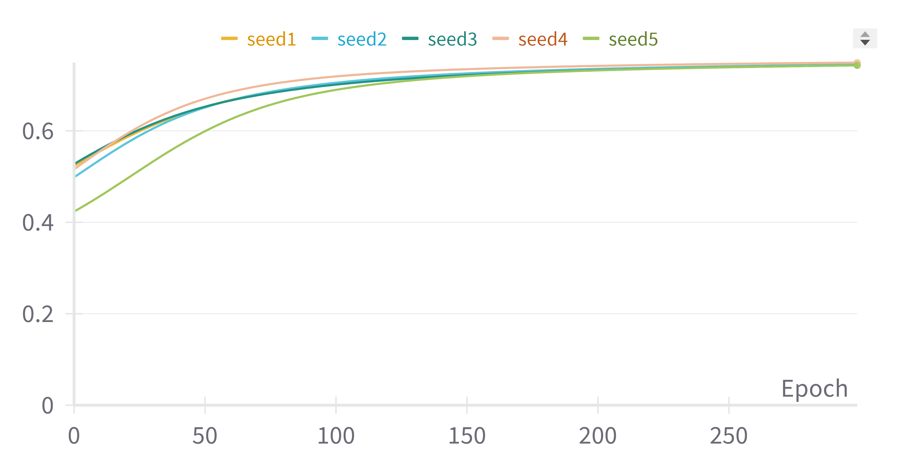
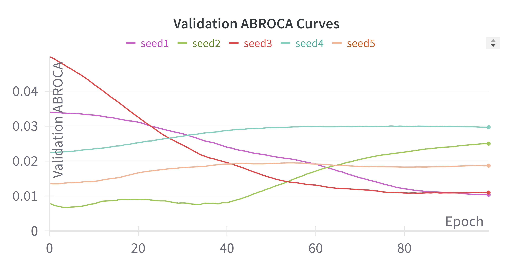
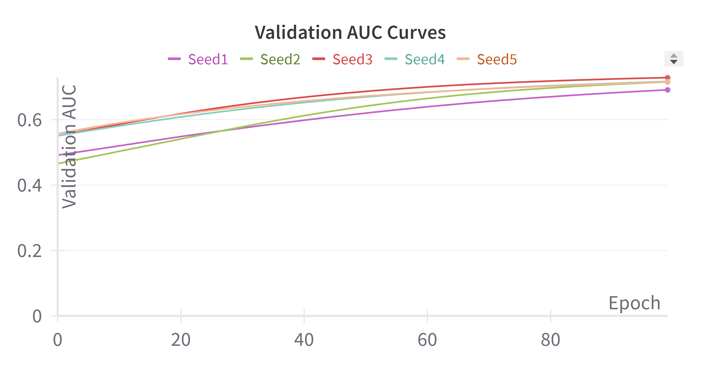

# Appendix

## Implementation details for ABROCA surrogate, operating points, and optimization

### Numerical computation of test-set ABROCA

To compute ABROCA in (2), we construct empirical ROC curves separately for each group on the test set. We evaluate both ROC curves on a shared monotone FPR grid that includes 0 and 1, and apply trapezoidal integration to the absolute difference between group TPRs.

### Differentiable ABROCA surrogate: grids, interpolation, and integration

**Threshold grid.** We use $N_{\text{bins}}=50$ equally spaced thresholds on $[0,1]$ (in code: `linspace(0.01, 0.99, 50)`).

**Temperature.** We set $\tau=0.1$ (or anneal from $\tau_{\text{start}}=0.05$ to a lower value over epochs using exponential decay $\tau \times 0.5^{\lfloor \text{epoch}/(\text{epochs}/3)\rfloor}$).

**Interpolation.** For each group, we obtain paired sequences $(\widetilde{\mathrm{FPR}}_g(t_k),\widetilde{\mathrm{TPR}}_g(t_k))$. We then construct a shared $\widetilde{\mathrm{FPR}}$ grid and linearly interpolate $\widetilde{\mathrm{TPR}}_g$ onto that grid before trapezoidal integration of the absolute difference.

**Absolute value.** We use the standard subgradient for $|\cdot|$ (and, if needed, specify the tie convention).

### Definitions and operating points for SPD and EOD

SPD and EOD are computed under an outreach policy that flags the top $q\%$ of students on the test set (equivalently, top $K$ students for the test-set cohort size). For a chosen cutoff $q\%$ (equivalently $K$ for a fixed cohort size), let $\hat{Y}=1$ denote "flagged". Then:

$$
\begin{aligned}
\mathrm{SPD} &= \Pr(\hat{Y}=1\mid A=0)-\Pr(\hat{Y}=1\mid A=1),\\
\Delta \mathrm{TPR} &= \Pr(\hat{Y}=1\mid Y=1,A=0)-\Pr(\hat{Y}=1\mid Y=1,A=1),\\
\Delta \mathrm{FPR} &= \Pr(\hat{Y}=1\mid Y=0,A=0)-\Pr(\hat{Y}=1\mid Y=0,A=1),\\
\mathrm{EOD} &= \max\left(|\Delta \mathrm{TPR}|,\ |\Delta \mathrm{FPR}|\right).
\end{aligned}
$$

We report the value(s) of $q$ used in each figure/table.

### Optimization settings (held constant across paired runs)

**Model.**  
Logistic regression implemented in PyTorch.

**Optimizer and learning rate.**  
Adam; learning rate $0.01$; weight decay $0.001$.

**Batching.**  
Full-batch (no minibatching).

**Early stopping.**  
Patience $50$; maximum epochs $1000$; checkpoint criterion matches the training objective (CE vs. total loss).

**Stabilization.**  
Gradient clipping with max norm $1.0$ (no EMA or other smoothing in the reported runs).

**Random seeds.**  
Ten fixed seeds: $42$, $123$, $456$, $789$, $1011$, $1213$, $1415$, $1617$, $1819$, $2021$.

# Digital Appendix Table A1. Full Hyperparameter Sensitivity (Validation)

**Scope.** Full version of the sensitivity table with all metrics (**AUC, ACC, ABROCA, SPD, EOD**) across Kaggle, OULAD, and UCI Student Performance.  
**Protocol.** Values are mean ± standard deviation on the validation split (5 seeds for Kaggle and UCI; 3 seeds for OULAD).  
For each sweep block, only one hyperparameter varies and the other two are fixed.

## A1.1 Lambda sweep (fixed: temperature = 0.1, threshold bins = 50)

| Hyperparameter | Value | Kaggle AUC | Kaggle ACC | Kaggle ABROCA | Kaggle SPD | Kaggle EOD | OULAD AUC | OULAD ACC | OULAD ABROCA | OULAD SPD | OULAD EOD | UCI AUC | UCI ACC | UCI ABROCA | UCI SPD | UCI EOD |
|---|---:|---:|---:|---:|---:|---:|---:|---:|---:|---:|---:|---:|---:|---:|---:|---:|
| λ | 0.0 | 0.948±0.001 | 0.908±0.002 | 0.036±0.001 | -0.233±0.011 | 0.009±0.001 | 0.791±0.000 | 0.718±0.001 | 0.058±0.000 | 0.079±0.001 | 0.041±0.002 | 0.955±0.002 | 0.901±0.005 | 0.027±0.003 | -0.048±0.026 | -0.033±0.016 |
| λ | 0.1 | 0.948±0.001 | 0.905±0.003 | 0.034±0.001 | -0.221±0.008 | 0.017±0.002 | 0.791±0.000 | 0.720±0.001 | 0.057±0.000 | 0.074±0.001 | 0.036±0.003 | 0.953±0.002 | 0.896±0.009 | 0.027±0.002 | -0.043±0.014 | -0.020±0.013 |
| λ | 0.3 | 0.945±0.001 | 0.900±0.001 | 0.031±0.001 | -0.209±0.007 | 0.009±0.005 | 0.791±0.000 | 0.720±0.000 | 0.054±0.000 | 0.062±0.002 | 0.027±0.003 | 0.945±0.001 | 0.876±0.015 | 0.026±0.004 | -0.045±0.020 | -0.009±0.028 |
| λ | 0.5 | 0.942±0.001 | 0.899±0.001 | 0.028±0.001 | -0.214±0.005 | -0.009±0.000 | 0.790±0.000 | 0.716±0.000 | 0.052±0.000 | 0.055±0.001 | 0.020±0.001 | 0.939±0.002 | 0.881±0.013 | 0.019±0.002 | -0.016±0.022 | 0.035±0.031 |
| λ | 1.0 | 0.935±0.001 | 0.889±0.002 | 0.021±0.001 | -0.196±0.004 | -0.003±0.000 | 0.786±0.001 | 0.711±0.002 | 0.045±0.001 | 0.036±0.003 | 0.006±0.003 | 0.918±0.005 | 0.848±0.000 | 0.027±0.006 | 0.087±0.000 | 0.151±0.000 |

## A1.2 Temperature sweep (fixed: λ = 0.3, threshold bins = 50)

| Hyperparameter | Value | Kaggle AUC | Kaggle ACC | Kaggle ABROCA | Kaggle SPD | Kaggle EOD | OULAD AUC | OULAD ACC | OULAD ABROCA | OULAD SPD | OULAD EOD | UCI AUC | UCI ACC | UCI ABROCA | UCI SPD | UCI EOD |
|---|---:|---:|---:|---:|---:|---:|---:|---:|---:|---:|---:|---:|---:|---:|---:|---:|
| τ | 0.01 | 0.945±0.001 | 0.899±0.001 | 0.029±0.001 | -0.213±0.006 | 0.000±0.005 | 0.790±0.000 | 0.718±0.001 | 0.055±0.000 | 0.068±0.003 | 0.032±0.001 | 0.944±0.002 | 0.871±0.012 | 0.021±0.004 | -0.054±0.024 | -0.022±0.034 |
| τ | 0.05 | 0.945±0.001 | 0.900±0.001 | 0.030±0.001 | -0.211±0.005 | 0.005±0.002 | 0.791±0.000 | 0.719±0.000 | 0.055±0.000 | 0.066±0.002 | 0.029±0.001 | 0.945±0.001 | 0.873±0.014 | 0.022±0.005 | -0.049±0.023 | -0.016±0.032 |
| τ | 0.1 | 0.945±0.001 | 0.900±0.001 | 0.031±0.001 | -0.209±0.007 | 0.009±0.005 | 0.791±0.000 | 0.720±0.000 | 0.054±0.000 | 0.062±0.002 | 0.027±0.003 | 0.945±0.001 | 0.876±0.015 | 0.026±0.004 | -0.045±0.020 | -0.009±0.028 |
| τ | 0.5 | 0.947±0.001 | 0.904±0.003 | 0.034±0.001 | -0.217±0.007 | 0.016±0.004 | 0.791±0.000 | 0.721±0.000 | 0.056±0.000 | 0.071±0.002 | 0.033±0.004 | 0.952±0.002 | 0.891±0.006 | 0.025±0.002 | -0.033±0.014 | -0.011±0.004 |
| τ | 1.0 | 0.948±0.001 | 0.905±0.003 | 0.035±0.001 | -0.223±0.007 | 0.016±0.005 | 0.791±0.000 | 0.719±0.000 | 0.057±0.000 | 0.075±0.001 | 0.037±0.002 | 0.953±0.002 | 0.899±0.011 | 0.028±0.003 | -0.047±0.008 | -0.020±0.013 |

## A1.3 Threshold-bin sweep (fixed: λ = 0.3, temperature = 0.1)

| Hyperparameter | Value | Kaggle AUC | Kaggle ACC | Kaggle ABROCA | Kaggle SPD | Kaggle EOD | OULAD AUC | OULAD ACC | OULAD ABROCA | OULAD SPD | OULAD EOD | UCI AUC | UCI ACC | UCI ABROCA | UCI SPD | UCI EOD |
|---|---:|---:|---:|---:|---:|---:|---:|---:|---:|---:|---:|---:|---:|---:|---:|---:|
| N_bins | 10  | 0.945±0.001 | 0.900±0.001 | 0.031±0.001 | -0.209±0.007 | 0.009±0.005 | 0.791±0.000 | 0.720±0.000 | 0.055±0.000 | 0.062±0.001 | 0.027±0.003 | 0.946±0.000 | 0.876±0.015 | 0.026±0.004 | -0.045±0.020 | -0.009±0.028 |
| N_bins | 25  | 0.945±0.001 | 0.900±0.001 | 0.031±0.001 | -0.209±0.007 | 0.009±0.005 | 0.791±0.000 | 0.720±0.000 | 0.054±0.000 | 0.063±0.001 | 0.027±0.002 | 0.945±0.001 | 0.876±0.015 | 0.026±0.003 | -0.045±0.020 | -0.009±0.028 |
| N_bins | 50  | 0.945±0.001 | 0.900±0.001 | 0.031±0.001 | -0.209±0.007 | 0.009±0.005 | 0.791±0.000 | 0.720±0.000 | 0.054±0.000 | 0.062±0.002 | 0.027±0.003 | 0.945±0.001 | 0.876±0.015 | 0.026±0.004 | -0.045±0.020 | -0.009±0.028 |
| N_bins | 100 | 0.945±0.001 | 0.900±0.001 | 0.031±0.001 | -0.209±0.007 | 0.009±0.005 | 0.791±0.000 | 0.719±0.000 | 0.054±0.000 | 0.062±0.002 | 0.027±0.003 | 0.945±0.001 | 0.876±0.015 | 0.026±0.004 | -0.045±0.020 | -0.009±0.028 |
| N_bins | 200 | 0.945±0.001 | 0.900±0.001 | 0.031±0.001 | -0.209±0.007 | 0.009±0.005 | 0.791±0.000 | 0.719±0.000 | 0.054±0.000 | 0.062±0.002 | 0.027±0.002 | 0.945±0.001 | 0.876±0.015 | 0.026±0.004 | -0.045±0.020 | -0.009±0.028 |

## Notes

- Fixed settings per sweep block:
  - **λ sweep:** temperature = 0.1, threshold bins = 50
  - **temperature sweep:** λ = 0.3, threshold bins = 50
  - **threshold-bin sweep:** λ = 0.3, temperature = 0.1
- Within each dataset, all runs use the same split rule, preprocessing, optimizer, and early-stopping criterion.
- This appendix table is the **full operational view** (includes threshold-dependent metrics), while the main paper keeps the compact view (AUC + ABROCA) for across-threshold sensitivity interpretation.

---

## Appendix Figures

### RQ1 ABROCA model (validation ABROCA)

### RQ1 ABROCA model (validation AUC)

### RQ1 CE model (validation ABROCA)

### RQ1 CE model (validation AUC)

### RQ1 Dual-objective model (validation ABROCA)

### RQ1 Dual-objective model (validation AUC)

